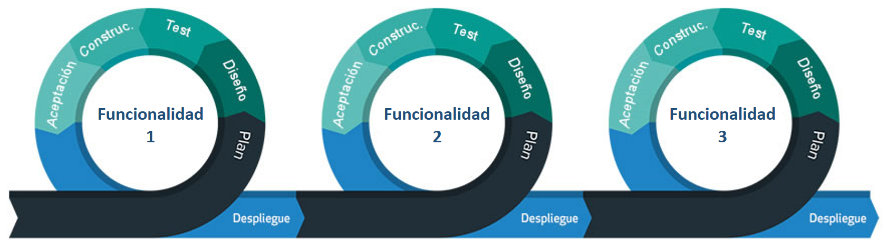

<p align="center">
  
</p>

&nbsp;
# ¿En qué consiste el proyecto?
## Descripción y motivación

La “Red Colmillo” es un **sistema de mensajería instantánea** dedicada al Instituto Tecnológico Autónomo de México (ITAM). El propósito de este software es permitirle a todos los alumnos, profesores y personal administrativo del ITAM tener un medio de comunicación rápido y efectivo. 

Este proyecto surge ante la necesidad de tener un sistema de comunicación eficiente dentro de la comunidad ITAM. La comunicación efectiva es una característica esencial para crear relaciones de trabajo positivas y productivas en un entorno educativo. Cuando la comunicación fluye a través de los integrantes de una institución, es posible difundir conocimiento y hacer más productivo el trabajo. Esto ayuda a cada miembro de la institución a alcanzar sus objetivos profesionales y personales. 

La forma en la que la "Red Colmillo" intenta proveer una herramienta de comunicación efectiva es a partir de lo siguiente. Primero, brinda un sistema de comunicación que le permite a los alumnos y profesores del ITAM tener un lugar de acceso fácil a la información que concierne las discusiones más relevantes de sus cursos. Segundo, les facilita a los miembros de la comunidad entablar conversaciones individuales o grupales con cualquier otro colega de la institución a través una interfaz amigable. Por último, la aplicación incluye un sistema de asistencia sobre asuntos estudiantiles por medio de un _Chat Bot_.

## Metodología de desarrollo del software
La “Red Colmillo” se desarrolla a partir de la **metodología impulsada por funcionalidades** (conocida en inglés como *feature driven*). Esta metodología ágil organiza el desarrollo de software al rededor del progreso e implementación de funcionalidades específicas, como se muestra en la figura 1. Es decir, el producto se construye a través de ciclos de desarrollo ágiles que se enfocan a implementar una única funcionalidad y probarla con el usuario. Una vez terminado el ciclo, se puede pasar al desarrollo de otra funcionalidad en una nueva iteración. El valor del desarrollo basado en funcionalidades es que te permite enfocarte en las funcionalidades que son altamente valoradas por el usuario y desarrollar un producto de calidad, basándonos en la experiencia de usuario. Es importante que, al revisar este repositorio, el código y el historial de versiones se tengan en cuenta la metodología de desarrollo utilizada. Todos los cambios que se hicieron al repositorio fueron elaborados bajo este concepto.

<p align="center">
  
  <p align="center">Figura 1: Metodología impulsada por funcionalidades. </p>
</p>

## Restricciones de diseño e implementación
La versión que se muestra en este repositorio es la **"Red Colmillo 1.0"**. Esta versión es únicamente un **prototipo de muy alta calidad**, más el software nunca fue desplegado en el entorno virtual de la comunidad ITAM. Para poder interactuar con el prototipo, se le sugiere al lector hacer lo siguiente:

1. Descargar [Just In Mind](https://www.justinmind.com/download).
2. Clonar este repositorio.
3. Abrir el prototipo ```RedColmillo.vp``` dentro de Just In Mind.

&nbsp;
# ¿Cuáles son algunos de los aspectos técnicos y de funcionalidad?
## Entorno operativo
El software estará diseñado para ser una **aplicación web** que opere con garantía en versiones más recientes de navegadores que soporten **HTML5** y **JavaScript**. Para correr el código en un navegador (```index.html```), se sugiere utilizar **Google Chrome**, Safari, Firefox o Microsoft Edge. También se sugiere correr el prototipo en una computadora portátil o de escritorio.

## Clases y características de usuario
Los usuarios que interactuarán con la aplicación son:
+ **Estudiantes:** todo individuo que esté tomando clases en la institución ya sea a nivel de licenciatura, maestría, doctorado o diplomado.
+ **Profesores:** todos los catedráticos de la institución.
+ **Personal administrativo:** todos los miembros administrativos de las divisiones académicas y departamentos de servicios escolares.
+ **Administradores del sistema:** personas encargadas de mantener la página web y el _Chat Bot_, así como asignar a los alumnos y profesores a los chat grupales de los cursos que les correspondan en cada semestre.

## Funcionalidades del sistema
A continuación, se hará mención de algunas de las funcionalidades que ofrece la "Red Colmillo" que fueron implementadas para el prototipo que se presenta en este repositorio.
### 1. Iniciar sesión
En esta aplicación ningún usuario puede crear una cuenta nueva. Las cuentas de inicio de sesión son otorgadas por el ITAM por medio de su servicio de autenticación de usuarios, el cual se integró al código de nuestro software.
<p align="center">
  
  <p align="center">Figura 2: Inicio de sesión de un ususario.</p>
</p>

### 2. Crear Grupos
Esta funcionalidad sirve para crear grupos nuevos en los que participarán alumnos y catedrático de la institución. El código de este repositorio está adaptado para que se permita crear un número ilimitado de grupos. El código también incluye una subrutina para que, al iniciar cada semestre, cada alumno y profesor sea integrado a los grupos de sus cursos correspondientes.
<p align="center">
  
  <p align="center">Figura 3: Creación de un nuevo grupo para el equipo de Ingeniería de Software.</p>
</p>

### 3. Buscar contactos
Para poder iniciar una conversación a través de un mensaje directo, un usuario puede buscar el contacto con el que se quiere comunicar. Esto lo hace a través de la sección de "búsqueda" que se proporcionará en la aplicación. Esta búsqueda se hace directamente con la base de datos del ITAM y abre una conversación entre los contactos que se van a comunicar.
<p align="center">
  
  <p align="center">Figura 4: Buscar en contactos a "Rubén.</p>
</p>

### 4. Comunicarse con el _Chat Bot_ de servicios escolares
Con el objetivo de mejorar la experiencia de los usuarios de nuestro software se diseñó un _Chat Bot_ llamado Colmillo. El usuario puede interactuar con Colmillo para consultar dudas respecto a funcionalidades de la aplicación o hacer preguntas acerca de los trámites y actividades más relevantes del ITAM. Este último punto podemos ilustrarlo con los siguientes ejemplos. Por un lado, el usuario puede consultar las fechas y avisos importantes del ITAM o, por otro lado, puede comunicarse con asesores virtuales de las distintas áreas de servicios escolares.
<p align="center">
  
  <p align="center">Figura 5: Conversación con el chatbot de Colmillo.</p>
</p>

### 5. Mandar mensajes directos
Uno de los objetivos primordiales del software es que el usuario pueda tener una conversación, de forma segura y accesible, con cualquier otro miembro del ITAM. El alumno entonces puede acceder a una interfaz donde mantiene conversaciones de mensajería directa con los contactos deseados. Esta interfaz debe mostrar en el centro de la pantalla el área de mensajería.
<p align="center">
  
  <p align="center">Figura 6: Conversación en mensajes directos.</p>
</p>


### 6. Mandar mensajes a grupos
Los grupos son un punto de interacción clave entre maestro y alumno. Por eso, ambos usuarios pueden mandar mensajes a grupos que visualizaran todos los miembros de este.
<p align="center">
  
  <p align="center">Figura 7: Conversación grupal del curso de Minería de Datos.</p>
</p>

### 7. Acceder a notificaciones
Al iniciar sesión, un usuario puede visualizar de manera rápida y sencilla los mensajes más importantes que recibió durante su ausencia. Esto le facilita al usuario dar seguimiento de sus conversaciones y visualizar anuncios importantes. Por ello, en un panel del lado derecho se muestran estas notificaciones.
<p align="center">
  
  <p align="center">Figura 8: Visualización de notificaciones.</p>
</p>

### 8. Subir documentos
Para extender las capacidades de la red de comunicación, se añade esta funcionalidad que le permite a los usuarios compartir documentos con sus colegas y profesores.
  
  <p align="center">Figura 9: Subir documentos al curso de Minería de Datos.</p>
</p>

### 9. Cerrar sesión
Con el fin de resguardar su seguridad, el usuario puede cerrar sesión cuando lo desee. Además, para proteger sus datos y conversaciones, el sistema a través de una subrutina en el código finaliza cualquier sesión en la que se detecta inactividad durante 15 minutos.

&nbsp;
# ¿Cómo explorar este repositorio?
Una vez que el usuario leyó este documento, se le recomienda seguir los pasos de la sección de [Restricciones de diseño e implementación](#Restricciones-de-diseño-e-implementación) y visualizar el prototipo en Just In Mind. La idea de esto es que el lector pueda experimentar la experiencia de usuario que ofrece el prototipo que presentamos. No obstante, si el lector quiere revisar el código puede hacerlo directamente en la carpeta de este repositorio llamada [RedColmillo](https://github.com/Ingenieria-de-Software-ITAM-2020/Top-Tiers/tree/main/RedColmillo). 

Nuestro equipo espera que el lector disfrute su experiencia en este repositorio y le pueda ser de utilidad para sus actuales o futuros proyectos.


