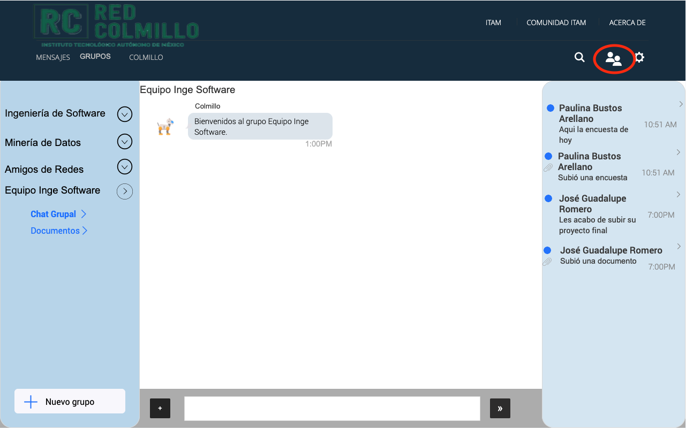

<p align="center">
  
</p>

**Ingeniería de Software**

# Tabla de contenido
1. **[Documento de Requerimientos](#documento-de-requerimientos)**
    1. [Introducción](#1-introducción)
        1. [Propósito](#11-propósito)
        2. [Convenciones del documento](#12-convenciones-del-documento)
        3. [Audiencia prevista y sugerencia de lectura](#13-audiencia-prevista-y-sugerencia-de-lectura)
        4. [Alcance del producto](#14-alcance-del-producto)
        5. [Referencias](#15-referencias)
    2. [Descripción General](#2-descripción-general)
        1. [Perspectiva del producto](#21-perspectiva-del-producto)
        2. [Funciones del producto](#22-funciones-del-producto)
        3. [Clases y características de usuario](#23-clases-y-características-de-usuario)
        4. [Entorno operativo](#24-entorno-operativo)
        5. [Restricciones de diseño e implementación](#25-restricciones-de-diseño-e-implementación)
        6. [Documentación del usuario](#26-documentación-del-usuario)
        7. [Supuestos y dependencias](#27-supuestos-y-dependencias)
    3. [Requerimientos de la interfaz externa](#3-requerimientos-de-la-interfaz-externa)
        1. [Interfaz de usuario](#31-interfaz-de-usuario)
        2. [Interfaz de hardware](#32-interfaz-de-hardware)
        3. [Interfaz de software](#33-interfaz-de-software)
        4. [Interfaz de comunicación](#34-interfaz-de-comunicación)
    4. [Funcionalidades del sistema](#4-funcionalidades-del-sistema)
        1. [Iniciar Sesión](#41-iniciar-sesión)
        2. [Crear grupos](#42-crear-grupos)
        3. [Buscar contactos](#43-buscar-contactos)
        4. [Comunicarse con el chatbot de servicios escolares](#44-comunicarse-con-el-chatbot-de-servicios-escolares)
        5. [Mandar mensajes directos](#45-mandar-mensajes-directos)
        6. [Mandar mensajes a grupos](#46-mandar-mensajes-a-grupos)
        7. [Acceder a notificaciones](#47-acceder-a-notificaciones)
        8. [Subir documentos](#48-subir-documentos)
        9. [Cerrar sesión](#49-cerrar-sesión)
    5. [Otros requerimientos no funcionales](#5-otros-requerimientos-no-funcionales)
        1. [Requerimientos de rendimiento](#51-requerimientos-de-rendimiento)
        2. [Safety Requirements](#52-safety-requirements)
        3. [Security Requirements](#53-security-requirements)
        4. [Atributos de calidad de software](#54-atributos-de-calidad-de-software)
        5. [Reglas de negocio](#55-reglas-de-negocio)

2. **[Casos de uso](#casos-de-uso)**
    1. [Subir documentos](#1-subir-documentos)
    2. [Mandar mensajes directos](#2-mandar-mensajes-directos)
    3. [Comunicarse con el chatbot de servicios escolares](#3-comunicarse-con-el-chatbot-de-servicios-escolares)
        
3. **[Plan de calidad](#plan-de-calidad)**
    1. [Identificador del plan de prueba](#1-identificador-del-plan-de-prueba)
    2. [Referencias](#2-referencias)
    3. [Introducción](#3-introducción)
    4. [Elementos de prueba](#4-elementos-de-prueba)
    5. [Problemas de riesgo de software](#5-problemas-de-riesgo-de-software)
    6. [Funcionalidades a probar](#6-funcionalidades-a-probar)
    7. [Funcionalidades que no se deben probar](#7-funcionalidades-que-no-se-deben-probar)
    8. [Enfoque](#8-enfoque)
    9. [Criterios de aprobación / falla del elemento](#9-criterios-de-aprobación--falla-del-elemento)
    10. [Criterios de suspensión y requisitos de reanudación](#10-criterios-de-suspensión-y-requisitos-de-reanudación)
    11. [Entregables de prueba](#11-entregables-de-prueba)
    12. [Tareas de prueba restantes](#12-tareas-de-prueba-restantes)
    13. [Necesidades ambientales](#13-necesidades-ambientales)
    14. [Necesidades de personal y capacitación](#14-necesidades-de-personal-y-capacitación)
    15. [Responsabilidades](#15-responsabilidades)
    16. [Horario](#16-horario)
    17. [Planificación de riesgos y contingencias](#17-planificación-de-riesgos-y-contingencias)
    18. [Aprobaciones](#18-aprobaciones)
    19. [Glosario](#19-glosario)
    
4. **[Arquitectura](#arquitectura)** 

5. **[Metodología](#metodología)** 

6. **[Documentación para replicar](#documentación-para-replicar)**

7. **[Presentación](#presentación)**
----

# Documento de Requerimientos
## 1. Introducción
### 1.1 Propósito
A continuación, se presenta el documento de especificación de requerimientos para la “Red Colmillo”, un sistema de comunicación interna dedicado al Instituto Tecnológico Autónomo de México. El propósito de este software será permitirle a todos los alumnos y profesores inscritos en el ITAM poder comunicarse con sus distintos compañeros, colegas o áreas administrativas del ITAM a lo largo de todo el ciclo escolar. El panorama que seguirá este SRS será dar perspectivas, definiciones y descripciones del software, además de especificar los requerimientos de cada una de las funcionalidades que ofrecerá el software. La versión que se muestra en este documento es "Red Colmillo 1.0".
### 1.2 Convenciones del documento
Para este documento de Especificación de Requerimientos de Software (SRS, por sus siglas en inglés), las prioridades de los requisitos se definen del 1 al 5 de la siguiente manera: a los más esenciales, se les asignará la prioridad 1, mientras que a los menos esenciales se les otorgará la 5.
### 1.3 Audiencia prevista y sugerencia de lectura
Este documento va dirigido al personal encargado de darle mantenimiento a la página web Red Colmillo, así como al personal administrativo y de cómputo que utilizarán y explicarán su uso a nuevos usuarios. Para el personal técnico o de desarrollo, se recomienda leer todo el documento de manera secuencial. Para nuevos usuarios, se recomienda leer únicamente la sección 1 de Introducción y la sección 2 de Descripción General.
### 1.4 Alcance del producto
La "Red Colmillo" es un software que le permite a los alumnos y profesores del Instituto Tecnológico Autónomo de México (ITAM) tener un medio rápido y eficiente de comunicación. La comunicación efectiva es una característica esencial para crear relaciones de trabajo positivas y productivas. Cuando la comunicación fluye a través de los integrantes de una institución educativa, se es posible difundir el conocimiento y volver más productivo el trabajo ayudando a alcanzar los objetivos, tanto profesionales, como personales, de cada miembro de la institución. Los beneficios que ofrece la Red Colmillo es brindar un sistema de comunicación que le permite a los alumnos y profesores tener un lugar de acceso fácil a la información que concierne las discusiones más relevantes que se llevan a cabo en los distintos cursos a los que estén inscritos durante el semestre. También, les facilita entablar conversaciones con cualquier miembro del ITAM. Todo esto se logra a través de una interfaz amigable para añadir para poder iniciar conversaciones individuales o grupales con miembros de la institución. Además, es un sistema que incluye la conversación de los miembros de la institución con un ChatBot.
### 1.5 Referencias


## 2. Descripción General
### 2.1 Perspectiva del producto
El software que se presenta en este documento consiste de un sistema de mensajería instantánea para los miembros de la comunidad ITAM. Red Colmillo pertenecerá al conjunto de aplicaciones que ofrece el ITAM, por lo que requerirá compartir recursos con estos elementos, además de que podrá tomar o proveer información a estas aplicaciones. Este software específicamente podrá acceder a la base de datos del ITAM que contiene la información acerca de los maestros, alumnos y materias que se ofrecen, además de información útil acerca de fechas importantes y de los departamentos administrativos de la institución. Esto último es para que el alumnado pueda comunicarse con Colmillo, el ChatBot del sistema, sin necesidad de contactar directamente al personal administrativo del ITAM.
### 2.2 Funciones del producto
Las principales funciones de Red Colmillo son:
+ Comunicarse con Colmillo: el alumno debe poder mandar mensajes al chat ChatBot del sistema.
+ Mandar mensajes a grupos: el alumno debe poder comunicarse con sus compañeros y profesor (a) de sus materias a través del chat grupal del curso.
+ Crear grupos: el alumno debe poder crear grupos para comunicarse con sus compañeros de equipo.
+ Mandar mensajes directos: el alumno debe poder comunicarse con los miembros de la comunidad ITAM.
+ Buscar contactos: el alumno debe poder buscar a los miembros de la comunidad ITAM para comunicarse con ellos.
+ Ver notificaciones: el alumno debe poder acceder a un log que muestre los mensajes de sus profesores (as) y los archivos recibidos.
### 2.3 Clases y características de usuario
Los usuarios que interactuarán con la aplicación son:
+ **Estudiantes:** todo individuo que esté tomando clases en la institución, ya sea licenciatura, maestría, doctorado, diplomado, etc.
+ **Profesores:** todos los catedráticos de la institución.
+ **Personal administrativo:** todos los miembros administrativos de las divisiones académicas y departamentos de servicios escolares (caja, becas, servicio social, etc.).
+ **Administrador del sistema:** persona (s) encargada (s) de mantener la página web y el ChatBot, así como asignar a los alumnos y profesores a los chat grupales de los cursos que les correspondan.
### 2.4 Entorno operativo
El software estará diseñado para ser una aplicación web que opere con garantía en versiones más recientes de navegadores que soporten HTML5 y JavaScript. Se sugieren Google Chrome, Safari, Firefox y Microsoft Edge. Es decir, funciona sobre cualquier sistema operativo que soporte estos navegadores. Se tomará como base el funcionamiento de la aplicación sobre una computadora como dispositivo.
### 2.5 Restricciones de diseño e implementación
Red Colmillo únicamente servirá como mensajería instantánea. No se podrán realizar llamadas de voz ni de video a través de la aplicación. Se utilizará el servicio de inicio de sesión del ITAM, así que el usuario tampoco podrá crear su propia cuenta, deberá ingresar con las credenciales proporcionadas por la institución. Por lo pronto, sólo se implementará el sistema en español, y únicamente como aplicación web. 
### 2.6 Documentación del usuario
El software incluirá un tutorial interactivo para el usuario la primera vez que inicie sesión. También podrá pedirle a Colmillo que le repita el tutorial interactivo. Además, le llegará un manual de usuario a su correo escolar.
### 2.7 Supuestos y dependencias
El software tiene como dependencias el sistema de autenticación del ITAM y el sistema que administra su base de datos. También se supone que los servidores del ITAM estén activos y tengan capacidad suficiente de respuesta para manejar las solicitudes de los usuarios. Además, se asume que los usuarios tendrán acceso a una computadora con acceso a internet para poder utilizar la aplicación.

## 3. Requerimientos de la interfaz externa
### 3.1 Interfaz de usuario
- Interfaz de mensajes de grupo.
- Interfaz de documentos por grupo.
- Interfaz de mensajes directos.
- Interfaz de chatbot Colmillo.
### 3.2 Interfaz de hardware
La aplicación web está diseñada principalmente para visualizarse en ordenadores. Sin embrago, puede visualizarse en cualquier dispositivo con acceso a internet.
### 3.3 Interfaz de software
Este sistema utilizará un microservicio del ITAM para autenticar el inicio de sesión y así proteger al usuario de un ataque a datos sensibles. Los datos generados dentro de la aplicación serán guardados en una base de datos de los servidores del ITAM.
### 3.4 Interfaz de comunicación
El sistema de mensajería utilizará el protocolo XMPP, que es un protocolo abierto y extensible, también utilizado por otras plataformas de mensajería instantánea como Google Talk, el chat de Facebook y Whatsapp. Además, se comunicará con la base de datos que se encuentra en un servidor por medio de Internet con ayuda del protocolo HTTP. Los datos enviados y recibidos mediante los protocolos de Internet son encriptados para evitar robo de información.

## 4. Funcionalidades del sistema

### 4.1 Iniciar sesión
#### 4.1.1 Descripción y prioridad
A esta funcionalidad se le otorgó prioridad muy alta (1) porque el usuario debe poder iniciar sesión para llevar a cabo las demás funcionalidades.
Ningún miembro de la comunidad ITAM podrá crear su propia cuenta; esta será otorgada por la institución. Es por eso que, para el inicio de sesión, se usará el servicio de autenticación del ITAM.
#### 4.1.2 Secuencias de estímulo / respuesta
Las acciones del usuario y respuestas del sistema que estimulan el comportamiento definido para esta funcionalidad son:
1. El usuario está inscrito o empleado en el ITAM durante el semestre próximo.
2. El usuario cuenta con su nombre de usuario otorgado por la institución y con su contraseña.
3. El usuario ingresa a la página web de Red Colmillo.
4. El sistema redirige al usuario a la página de autenticación de las credenciales de inicio de sesión del ITAM.
5. El usuario ingresa su nombre de usuario y contraseña.
6. En caso de que el usuario haya ingresado las credenciales correctas, se redirige al alumno a la página principal de Red Colmillo.
7. En caso de que el usuario haya ingresado las credenciales incorrectas, se le hace saber al alumno que su nombre de usuario y/o contraseña no concuerdan, y se repite desde el punto 3.
#### 4.1.3 Requerimientos Funcionales
- *REQ-1: El ITAM debe generar y otorgar al usuario sus credenciales de inicio de sesión.*
- *REQ-2: Únicamente los miembros inscritos al ITAM pueden hacer uso de esta herramienta, por lo tanto solo ellos están autorizados a hacer login.*
- *REQ-3: El usuario no debe poder cambiar su nombre de usuario.*
- *REQ-4: El usuario debe poder cambiar su contraseña.*

### 4.2 Crear Grupos
#### 4.2.1 Descripción y prioridad
A esta funcionalidad se le otorgó una prioridad media (3) porque el objetivo del sistema es mejorar la comunicación de los alumnos con los profesores. Esta funcionalidad sirve para crear grupos nuevos entre alumnos de la escuela. Se pueden crear un número ilimitado de grupos, al iniciar cada semestre los grupos automáticos serán los de cada clase.
#### 4.2.2 Secuencias de estímulo / respuesta
Las acciones del usuario y respuestas del sistema que estimulan el comportamiento definido para esta funcionalidad son:
1. El usuario ingresó a "Red Colmillo".
2. El usuario se dirige a la sección de grupos.
3. El usuario selecciona la opción de "Nuevo grupo".
4. El usuario ingresa el nombre y la descripción del nuevo grupo.
5. El usuario selecciona la opción de miembros.
6. El usuario selecciona la opción de agregar miembro.
7. El usuario ingresa el nombre del nuevo miembro.
#### 4.2.3 Requerimientos Funcionales
- *REQ-1: El usuario debe tener credenciales activas del ITAM.*
- *REQ-2: El usuario debe estár registrado en el sistema "Red Colmillo".*
- *REQ-3: El usuario debe poder crear y eliminar grupos.*
- *REQ-4: Sólo miembros del ITAM pueden ser agregados a los grupos.*
- *REQ-5: Los nuevos miembros del grupo deben aceptar una invitación al grupo nuevo.*

### 4.3 Buscar contactos
#### 4.3.1 Descripción y prioridad
Para poder iniciar una conversación a través de un mensaje directo, un usuario debe buscar primero en contacto del miembro del ITAM con el que se quiere comunicar. Esto lo puede realizar a través de la sección de búsqueda que se proporcionará en la aplicación. Se considera que esta es una funcionalidad de prioridad alta (2) porque brinda a los alumnos la información necesaria para poder utilizar la aplicación de mensajería directa. Sin embargo, se le ha asignado prioridad 2 debido a que no es la principal función del sistema. El alumno podrá acceder en la parte superior de la interfaz a esta funcionalidad.
#### 4.3.2 Secuencias de estímulo / respuesta
Las acciones del usuario y respuestas del sistema que estimulan el comportamiento definido para esta funcionalidad son:
1. El usuario ingresa a la Red Colmillo para mandar un mensaje.
2. El usuario conoce el nombre de la persona o destinatario al cual le desea mandar el mensaje.
3. El usuario busca al usuario o destinatario en la sección de búsqueda.
4. El usuario inicia su conversación.
#### 4.3.3 Requerimientos Funcionales
- *REQ-1: La sección de búsqueda deberá estar siempre presente en la interfaz gráfica para que el usuario pueda acceder a ella en cualquier momento.*
- *REQ-2: La funcionalidad de búsqueda deberá apoyarse de los servicios proporcionados por el ITAM para poder acceder a su base de datos de contactos.*
- *REQ-3: Cuando el usuario haga clic sobre la sección de búsqueda, deberá desplegarse una lista con los 5 contactos recomendados que se basará en un historial de las personas con las que el usuario más conversa.*
- *REQ-4: Cada que se ingresa una letra en la sección de búsqueda, la funcionalidad deberá desplegar una lista de los contactos sugeridos, según las letras que se hayan ingresado, por lo que deberá estar revisando constantemente la base de datos y comparando los valores para mostrar los más cercanos a la búsqueda.*
- *REQ-5: Al seleccionar un contacto de la sección de búsqueda, esta sección deberá de cerrarse y se deberá de abrir una conversación directa con el usuario seleccionado.*
- *REQ-6: En la sección de búsqueda aparecerá cualquier miembro de la institución ya sea alumno, profesor o administrativo. Además, se podrán buscar los grupos en los que el usuario se encuentra inscritos, aunque este no será el área principal para buscar grupos. Si se selecciona un grupo se abrirá la conversación general del mismo.*
- *REQ-7: Por cuestiones de seguridad, un usuario podrá bloquear a cualquier usuario únicamente de tipo "alumno". Los profesores y administrativos no podrán ser bloqueados. Hecho lo anterior, si el usuario al cual bloquearon trata de buscar al contacto que lo bloqueo, este no le aparecerá en la sección de búsqueda, por lo que no podrá mandarle mensajes.*

### 4.4 Comunicarse con el ChatBot de servicios escolares
#### 4.4.1 Descripción y prioridad
Con el objetivo de acercar a los usuarios a la comunidad del ITAM se diseñó Colmillo, el chatbot propio del ITAM. El usuario entonces podrá interactuar con Colmillo para consultar las fechas y avisos importantes por parte de la escuela o bien para comunicarse con un área de servicios escolares (como cajas, becas, centro de tesis). Se considera que esta funcionalidad tiene una prioridad alta (2) dado que le brinda al software un valor añadido que ningun otro software podría ofrecer al acercar a los alumnos con servicios propios de la institución.
#### 4.4.2 Secuencias de estímulo / respuesta
Las acciones del usuario y respuestas del sistema que estimulan el comportamiento definido para esta funcionalidad son:
1. El usuario inicia sesión en la Red Colmillo.
2. El usuario ingresa al área especial del chatbot Colmillo.
3. El usuario desea preguntarle a Colmillos qué fechas importantes se acercan.
4. Colmillo le da a conocer los eventos de esta semana del ITAM.
5. El usuario desea comunicarse con algun área de servicios escolares.
6. El usuario le pide a Colmillo que lo comunique con un área de servicios escolares.
7. Colmillo abre un nuevo caso (chat) con el área solicitada.
8. El usuario se comunica satisfactoriamente con servicios escolares.
#### 4.4.3 Requerimientos Funcionales
- *REQ-1: Cualquier alumno inscrito al ITAM puede hacer uso del chatbot Colmillo.*
- *REQ-2: El usuario debe comunicarse con Colmillo usando los servicios ya preestablecidos que ofrece.*
- *REQ-3: Debe haber personal del ITAM que ingrese las noticias y anuncios importantes en la base de Colmillo.*
- *REQ-4: El usuario solo puede pedir comunicarse con servicios escolares en los horarios de atención establecidos.*
- *REQ-5: Por cuestiones de seguridad, para no saturar los servicios, los usuarios no podrán enviar más de 60 mensajes por minuto.*
- *REQ-6: Cuando el usuario pida comunicarse con un área de servicios escolares, deberá abrirse un caso (chat) completamente nuevo y contactar alguna persona que pueda atender al usuario.*
- *REQ-7: Colmillo deberá avisar a las áreas de servicios escolares cuántos alumnos hay en cola para ser atendidos.*

### 4.5 Mandar mensajes directos
#### 4.5.1 Descripción y prioridad
Uno de los objetivos primordiales del software es precisamente que el usuario pueda tener una conversación, de forma segura y accesible, con cualquier miembro con quien así lo desee del ITAM. Es por ello que a esta funcionalidad se le determina una prioridad muy alta (1). El alumno entonces podrá acceder a una interfaz donde pueda mantener conversaciones de mensajería directa con los contactos deseados. Esta interfaz debe mostrar al centro de la imagen el área de mensajería.
#### 4.5.2 Secuencias de estímulo / respuesta
Las acciones del usuario y respuestas del sistema que estimulan el comportamiento definido para esta funcionalidad son:
1. El usuario desea comunicarse con otro miembro del ITAM de una forma rápida y segura.
2. El usuario iniciar sesión en la Red Colmillo.
3. El usuario hace uso de la funcionalidad de búsqueda para elegir el contacto con el que quiere comunicarse.
4. El usuario envía un mensaje directo a dicho contacto.
#### 4.5.3 Requerimientos Funcionales
- *REQ-1: Un alumno puede enviar un mensaje directo a cualquier alumno o profesor del ITAM. Con excepción de los usuarios que lo hayan bloqueado.*
- *REQ-2: Un usuario de tipo alumno podrá bloquear a otro usuario de tipo alumno y este segundo no podrá contactar al primero a través de mensajes personales.*
- *REQ-3: Un profesor puede enviar un mensaje directo a cualquier alumno o profesor del ITAM.*
- *REQ-4: Un alumno o profesor pueden enviar mensajes directos a cualquier área administrativa dada de alta en la Red Colmillo, como lo pueden ser el área de Caja, Becas, Servicios Escolares, entre otros. Aunque esta funcionalidad generalmente será abarcada por el chatbot de Colmillo.*
- *REQ-5: Al mandar un mensaje, este se visualizará en el área del chat hasta que el chat sea eliminado.*
- *REQ-6: Un usuario deberá poder visualizar todas las conversaciones recientes que no haya eliminado y su contenido.*
- *REQ-7: Todo usuario podrá mandar archivos (PDFs, archivos de la familia Windows) y fotografías (.jpg, .png, .tiff, .jepg, .gif) a través de la mensajería directa.*
- *REQ-8: Los usuarios podrán enviar emoticones por medio del chat.*
- *REQ-9: Todo mensaje deberá ser encriptado de "end to end" lo que implica que nunca se procesará ni se enviarán mensajes en claro.*
- *REQ-10: Ninguna funcionalidad de la Red Comillo podrá analizar o almacenar las conversaciones, para mantener así la privacidad de los usuarios.*
- *REQ-11: En el área de chat, cada vez que un usuario recibe un mensaje, se debe mostrar el nombre del usuario que lo envía y cada vez que contesta un mensaje debe aparecer igualmente su nombre.*
- *REQ-12: Junto a los mensajes aparecerá una imagen con la fotografía de perfil del usuario que lo envía. De no tener fotografía, aparecerá una silueta de una persona.*

### 4.6 Mandar mensajes a grupos
#### 4.6.1 Descripción y prioridad
A esta funcionalidad se le otorgó una prioridad muy alta (1) porque los grupos son un punto de interacción clave entre maestro y alumno. Los mensajes deben llegar a todos los miembros del grupo y guardarse en un historial. 
#### 4.6.2 Secuencias de estímulo / respuesta
Las acciones del usuario y respuestas del sistema que estimulan el comportamiento definido para esta funcionalidad son:
1. El usuario desea comunicarse con sus compañeros de clase y su maestro.
2. El usuario inicia sesión en la Red Colmillo.
3. El usuario ingresa a su grupo.
4. El usuario envia un mensaje al grupo.
#### 4.6.3 Requerimientos Funcionales
- *REQ-1: El usuario debe tener credenciales activas del ITAM.*
- *REQ-2: El usuario debe estar registrado en el grupo con el que se desea comunicar.*
- *REQ-3: El usuario debe poder leer el historial de todos los mensajes que se han enviado en el grupo.*
- *REQ-4: El usuario debe enviar emoticones o imagenes al chat del grupo.*
- *REQ-5: En cada mensaje se debe mostrar el nombre del usuario que lo envió.*
- *REQ-6: En cada mensaje se debe mostrar la imagen del usuario que lo envió.*
- *REQ-7: En cada mensaje se debe mostrar la hora en que se envió.*

### 4.7 Acceder a notificaciones
#### 4.7.1 Descripción y prioridad
Al iniciar sesión, el alumno debe poder visualizar de manera rápida y sencilla los mensajes más importantes recibidos durante su ausencia. A esta funcionalidad se le otorgó prioridad alta (2): aunque le facilitará al usuario el seguimiento de sus conversaciones y le permitirá visualizar más facilmente los anuncios de sus profesores, no es indispensable para el funcionamiento del sistema. En un panel del lado derecho, se mostrarán únicamente los mensajes de sus profesores y los archivos que se hayan mandado en sus grupos.
#### 4.7.2 Secuencias de estímulo / respuesta
Las acciones del usuario y respuestas del sistema que estimulan el comportamiento definido para esta funcionalidad son:
1. El usuario desea acceder a los anuncios de sus profesores.
2. El usuario inicia sesión con sus credenciales otorgadas por la institución.
3. Una vez dentro de la Red Colmillo, el usuario visualiza los mensajes de sus profesores en el panel a la derecha. De no tener mensajes pendientes, el área de notificaciones se mostrará vacía.
#### 4.7.3 Requerimientos Funcionales
- *REQ-1: Las notificaciones deben ser mostradas en orden cronológico.*
- *REQ-2: En el área de notificaciones, únicamente se mostrarán mensajes que el alumno no haya visualizado previamente.*
- *REQ-3: En el área de notificaciones, únicamente se mostrarán los últimos 5 mensajes recibidos por cada profesor (a).*
- *REQ-4: El alumno será notificado únicamente sobre mensajes de sus profesores, no sobre respuestas de sus compañeros.*
- *REQ-5: Cada notificación mostrará el nombre del profesor, la hora a la que fue recibido el mensaje y el contenido del mismo.*
- *REQ-6: El alumno podrá acceder al mensaje en el grupo al darle click a la notificación.*

### 4.8 Subir documentos
#### 4.8.1 Descripción y prioridad
A esta funcionalidad se le otorgó una prioridad media (3). Para extender las capacidades de una red de comunicación simple, esta funcionalidad permite que los usuarios puedan subir documentos a los grupos para que todos los miembros puedan verlos, estos documentos pueden ser desde material de clase hasta tareas.
#### 4.8.2 Secuencias de estímulo / respuesta
Las acciones del usuario y respuestas del sistema que estimulan el comportamiento definido para esta funcionalidad son:
1. El usuario desea subir un documento para que el grupo pueda ver el material.
2. El usuario inicia sesión en la Red Colmillo.
3. El usuario ingresa a su grupo.
4. El usuario entra a la sección de documentos.
5. El usuario se mete a la carpeta donde quiere subir el documento.
6. El usuario sube el documento.
#### 4.8.3 Requerimientos Funcionales
- *REQ-1: El usuario debe tener credenciales activas del ITAM.*
- *REQ-2: El usuario debe estar registrado en el grupo con el que se desea comunicar.*
- *REQ-3: El usuario debe ver un señalamiento en los documentos que él subió.*
- *REQ-4: El usuario debe poder descargar cualquier documento visible al grupo en general.*
- *REQ-5: El usuario debe poder eliminar sus archivos.*
- *REQ-6: El profesor debe poder descargar o ver todos los documentos del grupo.*
- *REQ-7: En cada documento se debe mostrar la hora a la que se subió.*

### 4.9 Cerrar sesión
#### 4.9.1 Descripción y prioridad
Con el fin de resguardar su seguridad, el usuario podrá cerrar sesión cuando lo desee. Además, para proteger sus datos y conversaciones, el sistema también podrá finalizar la sesión del usuario en caso de que se detecte inactividad durante 7 minutos. Esta funcionalidad cumple con los requisitos de seguridad, es por eso que se le otorgó una prioridad alta (2), sin embargo, no es necesaria para el funcionamiento general del sistema.
#### 4.9.2 Secuencias de estímulo / respuesta
Las acciones del usuario y respuestas del sistema que estimulan el comportamiento definido para esta funcionalidad son:
1. El usuario desea comunicarse con miembros de la comunidad ITAM a través de Red Comlillo.
2. El usuario inicia sesión.
3. El usuario finaliza el intercambio de mensajes directos y/o grupales.
4. El usuario selecciona el botón de "Configuración".
5. El usuario da click en "Cerrar sesión".
6. El sistema confirma el cierre de sesión redireccionándolo a la página de inicio de sesión.
#### 4.9.3 Requerimientos Funcionales
- *REQ-1: El sistema debe cerrar la sesión del usuario en caso de haber inactividad por un mínimo de siete minutos.*
- *REQ-2: El sistema debe mostrar un mensaje de confirmación de cierre de sesión en caso de que el usuario dé click al botón de "Cerrar sesión".*
    - *REQ-2.1: En caso de que el usuario seleccione "Sí", el sistema debe cerrar la sesión del usuario.*
    - *REQ-2.2: En caso de que el usuario seleccione "No", el sistema debe seguir activo.*
- *REQ-3: Al cerrar la sesión, el sistema debe redirigir al usuario a la interfaz de inicio de sesión del ITAM.*
- *REQ-4: En caso de que el usuario cierre la ventana sin finalizar su sesión, el sistema debe cerrar sesión automáticamente.*

## 5. Otros requerimientos no funcionales
### 5.1 Requerimientos de rendimiento
El sistema debe tener un tiempo de respuesta menor a 200ms. Además de esto, se requiere que los servidores y bases de datos del ITAM se encuentren activos para que la aplicación funcione correctamente durante el semestre. La aplicación deberá poder soportar una carga de 6000 usuarios realizando 1 solicitud por segundo.
### 5.2 Safety Requirements
Dada la naturaleza personal de la mensajería privada y los riesgos que esta puede provocar, se protegerá la privacidad y seguridad de los usuarios incorporando cifrado de extremo a extremo en nuestra aplicación. Sabiendo que podrían existir usuariso que le den un mal uso a esta herramienta, los usuarios podrán evitar que alguien se comunique con ellos directamente desde un chat utilizando la función de bloqueo. Esto evitará permitir que esta plataforma se utilice con objetivos de bullying o acoso. 

Es un hecho que las pantallas causan fatiga ocular (ojo seco, visión borrosa, dolor de cabeza...) por lo que se recomienda a los usuarios tomarse un descanso de 5 minutos después de cada hora que pasen utilizando nuestra aplicación. 
### 5.3 Security Requirements
* El software protegerá la confidencialidad de los usuarios resguardando los datos sensibles como nombres de usuarios y grupos a los que están inscritos los distintos alumnos. Las conversaciones privadas se mantendrán de esta forma y su contenido solo podrá visualizarse por los miembros de la conversación. Toda conversación será protegida y encriptada al momento de ser enviada, procesada o almacenada la Red Colmillo para mantener la privacidad de los usuarios y sus conversaciones.
* Todos los usuarios que inicien sesión serán automáticamente verificados utilizando un microservicio provisto por el Instituto Tecnológico Autónomo de México. La Red Colmillo proveerá al sistema del ITAM el usuario y contraseña del individuo que esté solicitando tener acceso a la página de tal forma que la contraseña se provea ya hasheada para evitar un filtro de esta información sensible durante el proceso de comunicación con los servidores del ITAM.
* Se protegerá la integridad de los datos para que no haya modificaciones erróneas en las especificaciones de los alumnos y sus características, en el contenido de las conversaciones y en los archivos que se hayan subido al sistema.
* Se harán backups cada minuto de la información del sistema, las conversaciones y los grupos existentes.
* Ante una caída del sistema, existirá un tiempo máximo de tolerancia y espera de 30 minutos. Durante las dos semanas del curso y las últimas 3 semanas del curso (que incluyen los exámenes finales) el tiempo de máxima tolerancia y espera ante una caida debe reducirse a 15 minutos.
* Service Level Agreements = 90%
* El software utilizará autenticación dos pasos cada vez que un usuario ingrese al sistema de un dispositivo no marcado previamente como confiable. Este proceso le requerirá al alumno confirmar el inicio de sesión a través de un correo institucionales que se le mandará.
* Los permisos administrativos que permitan alterar la información de los cursos y sus grupos no deberán asignarse a los alumnos y/o profesores, solo al administrador del sistema. Los profesores y alumnos podrán modificar la información de los grupos que ellos creen de manera independiente.
* Cada acción que se lleve a cabo en la Red Colmillo deberá de guardarse en el log del sistema. Las acciones correspondientes a mandar mensaje únicamente deberán de indicar las personas que están entablando una conversación, más nos se guardará el contenido de esta.
* Cada que se altere la información de un curso, deberá de notificarse al profesor de este. El sistema deberá verificar diariamente que los miembros pertenecientes a cada grupo sigan inscritos al mismo, de lo contrario deberá eliminar al alumno. Si por alguna razón un profesor abandona la institución durante el semestre, deberá protegerse el grupo. El profesor será eliminado y los permisos que tenía pasarán al administrador del sistema.

### 5.4 Atributos de calidad de software
- **Fiabilidad:** Una vez puesto en producción el código, este no debe de presentar más de un incidente de alta prioridad al mes. Por este término entendemos a los incidentes que no le permitan a los usuarios mantener conversaciones en sus grupos privados o conversaciones directas. También, deberá de cuidarse que los números de incidentes bajo presión, que consideramos a los que sucedan en las primeras dos semanas de clases y en las últimas tres semanas donde se presentan los exámenes finales, sean menor a 5 durante esos plazos. Esto para poder garantizar que el servicio de la Red Colmillo estará funcionando correctamente durante las semanas críticas que necesitan que exista una herramienta de comunicación entre los miembros de la institución. Por último, nos enfocaremos que el promedio de errores por usuario de alumno sea el menor posible dentro de nuestros 3 tipos de usuarios, debido a que los usuarios tipo alumno serán nuestra prioridad en la Red Colmillo.

- **Rendimiento:** 
Mensualmente deberan de hacerse pruebas de carga en las que se estrese el sistema. Deberá verificarse que los servidores pueden soportar una carga de 6000 usuarios realizando 1 solicitud por segundo. Además existirá un panel de "Application performance monitoring (APM)" que monitoree el comportamiento de nuestros perfiles y nos permita obtener información para hacer los cambios necesarios en el sistema. El APM deberá revisarse al menos una vez por semana.

- **Seguridad:** 
El sistema deberá de procurar no tener vulnerabilidades que permita que se comparta el contendio de las conversaciones. También deberá cuidarse los permisos de autenticación y de uso, principalmente enfocandonos a que las personas que no pertenezcan a ciertos grupos no puedan tener acceso a ellos. Ante una vulnerabilidad el sistema y el equipo de desarrollo deberá presentar un tiempo de resolución menor a los 30 minutos. Por último, cada 15 días deberá revisarse los parametros de seguridad y actualizarse de ser necesario.

- **Mantenibilidad:** 
Los desarrolladores deberan de cuidar tener los mismos estándares, mismas formas de documentació y misma nomenclatura que ayude a que todos entiendan el código y pueden contribuir de forma sencilla. Para ello utilizaremos TRAVIS como sistema de apoyo para mantener los estándares.

- **Capacidad de entrega:**  
En una etapa inicial, los primeros 3 meses de producción, el equipo deberá de poder hacer entregables cada dos semanas hasta tener la aplicación corriendo de una forma estable. Durante el primer año de la Red Colmillo, los entregables para lanzar a producción podrán reducirse a hacerse de manera mensual. Depués del primer año y si el equipo lo considera apropiado, se deberá de lanzar a producción cada tres meses.

### 5.5 Reglas de negocio
Todos estos roles tienen acceso a las funcionalidades descritas en la sección [Funcionalidades del sistema](#4-funcionalidades-del-sistema). Tenemos tres roles dentro de la red Colmillo:

**Alumno**: Este rol es el usuario por defecto pensado en el software. Para tener este rol, solo se necesita poder iniciar sesión en los servicios del ITAM.

**Profesor**: Este rol lo brinda la institución. Los profesores podrán además mandar mensajes importantes al grupo que están impartiendo, dejar tareas y administrar el grupo de la materia. Los profesores no pueden ser bloqueados.

**Empleado**: Este rol está diseñado para los asistentes que trabajan en algún área de servicios escolares. Estos podrán dado el área que están asignados, atender peticiones de alumnos. 

**Administrador**: Este rol es para los administrativos de la institución, que tienen el privilegio de dar rol de empleado y profesor.

# Casos de uso
Se realizaron casos de uso de tres [funcionalidades listadas en el documento de requerimientos](#4-funcionalidades-del-sistema): subir documentos a grupos, mandar mensaje directo y conversar con Colmillo.

## 1. Subir documento


## 2. Mandar mensajes directos


## 3. Comunicarse con el ChatBot de servicios escolares


# Plan de calidad
## 1. Identificador del plan de prueba
Prueba 1.0 del prototipo en JustInMind 9.1.4 para la aplicación Red Colmillo en su versión 1.0

## 2. Referencias
El desarrollo de las pruebas de este prototipo se hará a través de la plataforma de JustInMind 9.1.4. Este software puede ser descargado a través del siguiente link:
https://www.justinmind.com/download. Si el lector desconoce el uso de esta herramienta, puede apoyarse del manual de uso que se encuentra en el siguiente link: https://www.justinmind.com/support/. Una vez puesto en producción, las pruebas se harán utilizando Heurio. Este software puede ser descargado a través del siguiente link:https://chrome.google.com/webstore/detail/heurio-ux-review-visual-f/pjdbofhiijhapnmpgilkeammkanglfdj. Si el lector desconoce el uso de esta herramienta, puede apoyarse del manual de uso que se encuentra en el siguiente link: https://www.heur.io/support.

Para poder conocer más acerca de la aplicación que se pondrá a prueba, se le recomienda al lector leer antes los puntos de este documento dedicados a al [Documento de Requerimientos](#documento-de-requerimientos), la [Metodología](#metodología) y la [Arquitectura](#arquitectura). Estos documentos darán una mejor visión acerca de los objetivos que se quieren lograr con el desarrollo y prueba de la Red Colmillo 1.0.

## 3. Introducción

El objetivo del proyecto es crear un prototipo que cumpla los requerimientos de UX sobre las funcionalidades más importantes de un sistema de comunicación entre alumnos y trabajadores del Instituto Tecnológico Autónomo de México. Asimismo, resaltar la importancia de la documentación, metodología y arquitectura de un proyecto.

## 4. Elementos de prueba
- Validación de que el usuario y contraseña concuerden.
- Que las pantallas se desplieguen correctamente.
- Que los botones redireccionen a las pantallas correctas.
- Que los botones tengan los links bien definidos.
- Que se pueda interactuar con los inputs de forma correcta.
- Que todos los usuarios puedan enviar y recibir mensajes.
- Que no existan pérdidas de información.

## 5. Problemas de riesgo de software
- Que el servidor de la aplicación se encuentre fuera de servicio.
- Que el sistema del ITAM con los datos de los usuarios esté fuera de servicio.
- Que el sistema no pierda los documentos o mensajes que se manden.

## 6. Funcionalidades a probar
- Que el usuario pueda iniciar sesión.
- Que el sistema permita al usuario crear nuevos grupos.
- Que el sistema permita buscar contactos.
- Que el usuario pueda mandar mensajes a grupos.
- Que el usuario pueda subir documentos.
- Que el usuario pueda mandar mensajes directos.
- Que el usuario pueda comunicarse con el chatbot del sistema.
- Que el usuario pueda acceder a notificaciones.

## 7. Funcionalidades que no se deben probar
- Que el usuario pueda cerrar sesión.
- Que se mantenga un historial de mensajes.
- Que se configure el perfil.
- Que el usuario tenga conexión a internet para utilizar la aplicación.

## 8. Enfoque
Como se mencionó con anterioridad, el prototipo se realizó en Justinmind, una herramienta de creación para prototipos de aplicaciones web y móviles y wireframes de sitios web de alta fidelidad. Dentro de Justinmind, se eligió crear el prototipo para una computadora de escritorio, ya que se desea que el sistema sea una aplicación web. Se planea que el sistema funcione en los navegadores mencionados en [Documento de Requerimientos: Entorno operativo](#24-entorno-operativo). 

En el documento se proponen diversas pruebas que se podrían realizar una vez que se realice la entrega final del sistema. Se debe acordar el valor deseado para las métrica *Mean Time Between Failures*. Se estima que se realizarán entregables una vez cada dos semanas. Al final de cada reunión, se debe entregar un reporte al *Product Manager*, informando posibles errores que puedan existir en el entregable de prueba. En esta primer prueba, se debe verificar que las funcionalidades establecidas en [Funcionalidades a probar](#6-funcionalidades-a-probar), junto con los [Elementos de prueba](#4-elementos-de-prueba), se ejecuten de manera correcta. Al ser solamente un prototipo, no se probará la obtención ni inserción de datos a las bases. Con la última entrega, se deben comprobar todas las funcionalidades, incluyendo las listadas en [Funcionalidades que no se deben probar](#7-funcionalidades-que-no-se-deben-probar). Se lanzará la versión final únicamente cuando las funcionalidades del sistema superen los criterios listados en [Criterios de aprobación / falla del elemento](#9-criterios-de-aprobación--falla-del-elemento).

## 9. Criterios de aprobación / falla del elemento

Se espera que, a nivel de front-end, los elementos de las interfaces puedan ser probadas para comprobar su funcionamiento correcto. En cuanto a infraestructura, se espera un porcentaje muy bajo de fallas, en donde se pueden encontrar errores al subir documentos por el tipo de documento.

## 10. Criterios de suspensión y requisitos de reanudación

- Las pruebas que involucren funcionalidades que consideramos de prioridad muy alta (1) no deben ser nunca puestas en suspensión.
- Las pruebas con el chatbot serán suspendidas siempre que los microservicios del ITAM estén abajo o en mantenimiento. Estas serán reanudadas en cuanto esté arriba los servicios del ITAM.
- Se suspenderan las pruebas si se encuentra una falla en el sistema que afecte las funcionalidades del sistema. Se retomará en cuanto el equipo arregle dicha falla.

## 11. Entregables de prueba

Se entregará un documento detallado de las funcionalidades que se probaron. Para cada funcionalidad, se especificarán los resultados de las pruebas hechas para cada rol; esto es, alumno, personal y administrativos.

## 12. Tareas de prueba restantes

- Permitir que el usuario configure su perfil.
- Lograr que el usuario pueda ver todo el historial de los mensajes en un grupo.
- Permitir que los usuarios puedan descargar los documentos sin tener fallas.
- Crear una validación de documentos.

## 13. Necesidades ambientales

- El usuario necesitará acceso a una computadora o celular inteligente.
- Es necesario que el usuario tenga acceso a internet.
- Es necesario que el usuario tenga credenciales activas en el ITAM.

## 14. Necesidades de personal y capacitación
Para llevar a cabo las pruebas mencionadas en este documento, utilizaremos la aplicación de Heurio. Todo el personal deberá de capacitarse antes de realizar las pruebas. A este tiempo se le dedicará una semana. También se podrán apoyar del siguiente link: https://www.heur.io/support. También, todo miembro del equipo que participe en las pruebas deberá haber leido completamente este plan de calidad, además de el  [Documento de Requerimientos](#documento-de-requerimientos).

Por otro lado, las personas encargadas de las pruebas deberán tener conocimiento completo de la funcionalidad encargada de probar. Además, los encargados de probar la integración con los servicios del ITAM, deberán tener conocimiento de las APIs que ofrece el ITAM.

## 15. Responsabilidades

El equipo de pruebas constará de 4 personas las cuales dividiremos en dos equipo, cada uno con dos personas. El equipo 1 se enfocará a las labores de mensajeria directa y de grupos, mientras que el equipo 2 se enfocará a las labores del chatbot y funcionalidades generales. La división se hará de la siguiente manera:

Equipo 1 (miembros Ruben Romero y Juan Carlos Sigler):
- Que el usuario pueda mandar mensajes a grupos.
- Que el usuario pueda subir documentos.
- Que el usuario pueda mandar mensajes directos.

Equipo 2 (miembros Andrea Padilla y Manuel Fernández):
- Que el usuario pueda iniciar sesión.
- Que el sistema permita al usuario crear nuevos grupos.
- Que el sistema permita buscar contactos.
- Que el usuario pueda comunicarse con el chatbot del sistema.
- Que el usuario pueda acceder a notificaciones.

## 16. Horario
Red Colmillo estará lista en 8 meses: el primer mes se realizará el diseño y prototipado de la aplicación, se destinarán seis meses al desarrollo y un mes a pruebas finales.  Aunque por ahora sólo se tenga el prototipo de la aplicación, se planea que los entregables del desarrollo de software se relizarán cada dos semanas, estimando realizar la entrega final en 6 meses. Esta se probará durante un mes para verificar el correcto funcionamiento. Al pasar los criterios de prueba, se lanzará la aplicación. 

## 17. Planificación de riesgos y contingencias

- En caso de que no haya personal suficiente para hacer las pruebas de integración con los servicios del ITAM, se extenderá el periodo de prueba hasta tener la suficiente capacitación.
- En caso de fallas en la integridad, se reiniciarán todas las pruebas para cada funcionalidad.

## 18. Aprobaciones

Dado que la aplicación es para individuos del ITAM, solo se necesitaría la aprobación de las autoridades del ITAM para obtener los datos sobre los grupos de clases y las cuentas de los usuarios para acceder.

## 19. Glosario

- Red Colmillo: Nombre del sistema.
- Clave única: Clave de identificación asociada al ITAM.

# Arquitectura
Actualmente, la Red Colmillo trabaja con arquitectura por eventos donde la aplicación utiliza la información en tiempo real proporcionada por los usuarios para orquestar decisiones. Aquí, los creadores de eventos o módulos, es decir los usuarios, transmiten la necesidad de entablar una conversación, en un tiempo dado, al gestor de eventos (la plataforma online), quien agregaría esta transmisión a su aplicación para poder conectar a los usuarios que se quieren comunicar con algún miembro o área de servicios del ITAM. Alguno de los módulos que el orquestador pudiera manejar se podría ver como los siguientes:
-	Procesar usuario que quiere iniciar una conversación.
-	Iniciar un canal de conversación.
-	Subir un documento o archivo
-   Procesar usuario que quiere conversar con el ChatBot de Colmillo.
-   Procesar usuario que quiere comunicarse con algún área de servicios del ITAM (caja, servicios escolares, becas, etc). 
-	Finalizar una comunicación

Las características que hacen que el uso de eventos sea apropiado para nuestro equipo de desarrollo son las siguientes. Primero, el producto debe tender a reestructurarse y replantearse cotidianamente, ser dinámico y no estático lo cual suele pasar con productos y plataformas enfocadas a alumnos universitarios las cuales deben actualizarse constantemente para cubrir las necesidades de los alumnos y permanecer atractiva con el paso del tiempo. Segundo, debe ser un producto cuyo uso se espere que crezca y evolucione con el tiempo, lo cual causaría tener cada vez más usuarios y requerirá poder escalar el producto, lo cual es posible gracias a la atomicidad de los eventos y puede ser un escenario realista de nuestra aplicación ya que esta podría extenderse en el futuro a otras universidades a las cuales se les haga atractivo el producto. Tercero debe ser un producto que requiera gran agilidad y alto despligue lo cual es probable que necesite una aplicación de chateo que debe estar funcionando siempre de forma estable y en su última versión durante todo el semestre sin excepciones.

# Metodología
La metodología que elegimos para el desarrollo de la Red Colmillo es la basada en funcionalidades (feature driven). Este es un marco de la metodología ágil que organiza el desarrollo de software al rededor del progreso y desarrollo de funciones específicas.

Elegimos esta metodología debido a que el proyecto de desarrollo de la Red Colmillo se puede discretizar fácilmente alrededor de proyectos de características independientes como lo son mandar un mensaje personal, mandar un mensaje a un grupo, iniciar sesión, conversar con el ChatBot de Colmillo, entre otros. Estas funcionalidades nos permiten construir el desarrollo de nuestra aplicación alrededor de ellas tomando ciclos de desarrollo para cada funcionalidad. El valor del desarrollo basado en funcionalidades es que te permite enfocarte en las funciones que son altamente valoradas por el usuario y desarrollar un producto de calidad basado en la experiencia de usuario.

Los pasos de desarrollo con esta metodología se hacen de la siguiente forma. Primero, se desarrolla un modelo global de la aplicación lo cual hicimos planteando cual era el objetivo de la aplicación y como iba a funcionar de manera general de tal forma que cumpla con los objetivos que se plantearon que eran necesarios resolver con el uso de esta aplicación. Más adelante, se genera una lista de características y funcionalidades que debe cubrir la aplicación describiendo todos los requerimientos de cada funcionalidad; esto se realizó utilizando un Documento de Requerimientos. Hecho lo anterior, se planifica el desarrollo de la aplicación por funcionalidad lo cual requirió que definiéramos la manera y el orden en la cual llevaríamos acabo el desarrollo de funcionalidades. Más adelante, se diseñan modelos específicos de las características de cada funcionalidad, lo cual hicimos en el desarrollo del prototipo donde cada ciclo de trabajo se desarrolló completamente una funcionalidad específica de la aplicación y una vez finalizada procedimos a la siguiente. Hecho lo anterior, finalmente, se puede construir y desarrollar la funcionalidad final que se incorporará al producto final, lo cual no desarrollamos esta vez debido a que el alcance del producto se quedará en un prototipo de alto nivel.

Creemos que es conveniente hacer uso de esta metodología debido a que permite el desarrollo rápido de productos por medio del desarrollo continuo y eficiente de código enfocado al desarrollo total e integral de funcionalidades de un sistema. Este tipo de metodología le permite a los equipos moverse rápidamente por el desarrollo del producto lo cual resulta ser conveniente para un equipo de desarrolladores como nosotros que suponemos tendremos tiempo limitado al ser estudiantes y al mismo tiempo querer desarrollar una aplicación de comunicación para el ITAM la cual debe de entregarse y desplegarse lo antes posible suponiendo que el ITAM quisiera tener lista la aplicación para el próximo semestre.


# Documentación para replicar

Requisitos
- Descargar [Justinmind](https://www.justinmind.com/download).
- Clonar o descargar este repositorio.

A continuación se muestran los pasos a seguir para navegar sobre el prototipo del software.

1. Abrir Justinmind 
2. Abrir prototipo ```RedColmillo.vp```
3. Clic en simular prototipo.
4. Ingresar correo y contraseña, y clic en iniciar sesión.

5. Clic en "Chat grupal".
6. Escribir "Mi computadora no tiene cámara :(((" como mensaje.

7. Clic en el ícono de enviar.
8. Clic en "Documentos".
9. Clic en "Materiales de clase".
10. Clic para regresar a documentos.

11. Clic en "Tareas"
12. Clic en "Nuevo"
13. Clic en "Nuevo grupo"
14. Escribir "Equipo Inge Software" en nombre del grupo, escribir descripción y clic en "Crear Grupo".

15. Clic en ícono para buscar personas.

16. Clic en "Agregar miembros".
17. Escribir "ruben" en la barra de buscador y clic en ícono de lupa.

18. Clic en "Rubén Romero Ortega".
19. Clic en ícono para buscar personas nuevamente.
20. Clic en notificación de "Liliana Millán".

21. Ir a la pestaña de mensajes.

22. Clic en "Rubén Romero".
23. Escribir "Había tarea??????" en la barra de mensajes y enviar.

24. Clic en "Nuevo chat"
25. Escribir "Andrea" en el buscador y clic en el la lupa.

26. Clic en "Andrea Padilla".
27. Escribir "Rola la tareaaaaaaa" en la barra de mensajes y enviar.
28. Ir a la pestaña de Colmillo.

29. Escribir y enviar (o clic) en "¿Qué fechas importantes se acercan?".

30. Clic nuevamente en ícono de enviar.
31. Escribir y enviar "Comunícame con Cajas"

32. Clic nuevamente en ícono de enviar.
33. Abrir el chat de Cajas

34. Dos veces clic en ícono de enviar.
35. Clic en "Regresar con Colmillo".


# Presentación

Para ver la presentación, siga el siguiente [link](https://docs.google.com/presentation/d/1yus-saQ1mBBxDOMPK3Nznbhivuaxosoj6aZfDHEqTgY/edit?usp=sharing)


