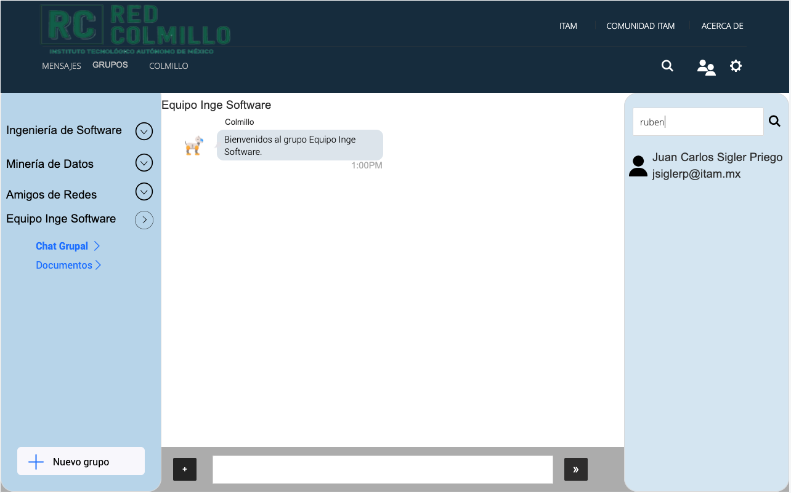

<p align="center">
  
</p>

&nbsp;
# ¿En qué consiste el proyecto?
## Descripción y motivación

La “Red Colmillo” es un **sistema de mensajería instantánea** dedicada al Instituto Tecnológico Autónomo de México (ITAM). El propósito de este software es permitirle a todos los alumnos, profesores y personal administrativo del ITAM tener un medio de comunicación rápido y efectivo. 

Este proyecto surge ante la necesidad de tener un sistema de comunicación eficiente en la comunidad ITAM. La comunicación efectiva es una característica esencial para crear relaciones de trabajo positivas y productivas en un entorno educativo. Cuando la comunicación fluye a través de los integrantes de una institución, es posible difundir conocimiento y hacer más productivo el trabajo. Esto ayuda a cada miembro de la institución a alcanzar sus objetivos profesionales y personales. 

Los beneficios que intenta proveer este servicio son los siguientes. Primero, brinda un sistema de comunicación que le permite a los alumnos y profesores del ITAM tener un lugar de acceso fácil a la información que concierne las discusiones más relevantes de sus cursos. Segundo, les facilita a los miembros de la comunidad entablar conversaciones individuales o grupales con cualquier otro colega de la institución a través una interfaz amigable. Por último, la aplicación incluye un sistema de asistencia sobre asuntos estudiantiles por medio de un ChatBot.

## Metodología de desarrollo del software
La metodología de que elegimos para el desarrollo de la “Red Colmillo” es la **metodología impulsada por funcionalidades** (conocida en inglés como *feature driven*). Esta metodología ágil organiza el desarrollo de software al rededor del progreso e implementación de funcionalidades específicas, como se muestra en la figura 1. Es decir, el producto se construye a través de ciclos de desarrollo que se enfocan a implementar una única funcionalidad y probarla con el usuario. Una vez terminado el ciclo se puede pasar al desarrollo de otra funcionalidad en una nueva iteración. El valor del desarrollo basado en funcionalidades es que te permite enfocarte en las funcionalidades que son altamente valoradas por el usuario y desarrollar un producto de calidad basándose en la experiencia de usuario. Es importante que al revisar este repositorio, el código y el historial de versiones se tengan en cuenta la metodología de desarrollo utilizada. Todos los cambios que se hicieron al repositorio fueron elaborados bajo este concepto.

<p align="center">
  
  <p align="center">Figura 1: Metodología impulsada por funcionalidades. </p>
</p>

## Restricciones de diseño e implementación
La versión que se muestra en este respositorio es **"Red Colmillo 1.0"**. Esta versión es únicamente un **prototipo de muy alta calidad**, más el software nunca fue desplegado en el enotnro virtual de la comunidad ITAM. Para poder interactuar con el prototipo, se le sugiere al lector hacer lo sigueinte:

1. Descargar [Justinmind](https://www.justinmind.com/download).
2. Clonar este repositorio.
3. Abrir el prototipo ```RedColmillo.vp``` dentro de Justinmind.

&nbsp;
# ¿Cuáles son algunos de los aspectos técnicos y de funcionalidad?
## Entorno operativo
El software estará diseñado para ser una aplicación web que opere con garantía en versiones más recientes de navegadores que soporten **HTML5** y **JavaScript**. Para correr el códgio en un navegador (```index.html```), se sugiere utilizar **Google Chrome**, Safari, Firefox o Microsoft Edge. También se sugiere correr el prototipo en una computadora portatil o de escritorio.

## Clases y características de usuario
Los usuarios que interactuarán con la aplicación son:
+ **Estudiantes:** todo individuo que esté tomando clases en la institución, ya sea licenciatura, maestría, doctorado o diplomado.
+ **Profesores:** todos los catedráticos de la institución.
+ **Personal administrativo:** todos los miembros administrativos de las divisiones académicas y departamentos de servicios escolares.
+ **Administrador del sistema:** personas encargadas de mantener la página web y el ChatBot, así como asignar a los alumnos y profesores a los chat grupales de los cursos que les correspondan en cada semestre.

## Funcionalidades del sistema

### 1. Iniciar sesión
Ningún miembro de la comunidad ITAM podrá crear su propia cuenta; esta será otorgada por la institución. Es por eso que, para el inicio de sesión, se usará el servicio de autenticación del ITAM.
<p align="center">
  
  <p align="center">Figura 2: Inicio de sesión por un ususario.</p>
</p>

### 2. Crear Grupos
Esta funcionalidad sirve para crear grupos nuevos entre alumnos de la escuela. Se pueden crear un número ilimitado de grupos, al iniciar cada semestre los grupos automáticos serán los de cada clase.
<p align="center">
  
  <p align="center">Figura 3: Creación de un nuevo grupo para el equipo de Ingeniería de Software.</p>
</p>

### 3. Buscar contactos
Para poder iniciar una conversación a través de un mensaje directo, un usuario debe buscar primero en contacto del miembro del ITAM con el que se quiere comunicar. Esto lo puede realizar a través de la sección de búsqueda que se proporcionará en la aplicación. Se considera que esta es una funcionalidad de prioridad alta (2) porque brinda a los alumnos la información necesaria para poder utilizar la aplicación de mensajería directa. Sin embargo, se le ha asignado prioridad 2 debido a que no es la principal función del sistema. El alumno podrá acceder en la parte superior de la interfaz a esta funcionalidad.
<p align="center">
  
  <p align="center">Figura 4: Buscar en contactos a "Ruben.</p>
</p>

### 4. Comunicarse con el ChatBot de servicios escolares
Con el objetivo de acercar a los usuarios a la comunidad del ITAM se diseñó Colmillo, el chatbot propio del ITAM. El usuario entonces podrá interactuar con Colmillo para consultar las fechas y avisos importantes por parte de la escuela o bien para comunicarse con un área de servicios escolares (como cajas, becas, centro de tesis). 
<p align="center">
  
  <p align="center">Figura 5: Conversación con el chatbot de Colmillo.</p>
</p>

### 5. Mandar mensajes directos
Uno de los objetivos primordiales del software es precisamente que el usuario pueda tener una conversación, de forma segura y accesible, con cualquier miembro con quien así lo desee del ITAM. El alumno entonces podrá acceder a una interfaz donde pueda mantener conversaciones de mensajería directa con los contactos deseados. Esta interfaz debe mostrar al centro de la imagen el área de mensajería.
<p align="center">
  
  <p align="center">Figura 6: Conversación en mensajes directos.</p>
</p>


### 6. Mandar mensajes a grupos
Los grupos son un punto de interacción clave entre maestro y alumno. Los mensajes deben llegar a todos los miembros del grupo y guardarse en un historial.
<p align="center">
  
  <p align="center">Figura 7: Conversación grupal del curso de Minería de Datos.</p>
</p>

### 7. Acceder a notificaciones
Al iniciar sesión, el alumno debe poder visualizar de manera rápida y sencilla los mensajes más importantes recibidos durante su ausencia. Esto le facilitará al usuario el seguimiento de sus conversaciones y le permitirá visualizar más facilmente los anuncios de sus profesores. En un panel del lado derecho, se mostrarán únicamente los mensajes de sus profesores y los archivos que se hayan mandado en sus grupos.
<p align="center">
  
  <p align="center">Figura 8: Visualización de notificaciones.</p>
</p>

### 8. Subir documentos
Para extender las capacidades de una red de comunicación simple, esta funcionalidad permite que los usuarios puedan subir documentos a los grupos para que todos los miembros puedan verlos, estos documentos pueden ser desde material de clase hasta tareas.
<p align="center">
  
  <p align="center">Figura 9: Subir documentos al curso de Minería de Datos.</p>
</p>

### 9. Cerrar sesión
Con el fin de resguardar su seguridad, el usuario podrá cerrar sesión cuando lo desee. Además, para proteger sus datos y conversaciones, el sistema también podrá finalizar la sesión del usuario en caso de que se detecte inactividad durante 7 minutos.

